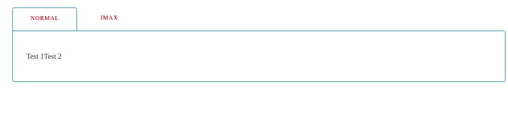
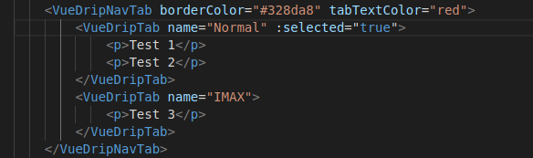

# vue-drip-navtab
Vue Drip Navtab is solution that could help you about use Tabs with VueJS 🎨

 [](https://www.npmjs.com/package/@arikardnoir/vue-drip-navtab) <a href="https://www.npmjs.com/package/@arikardnoir/vue-drip-navtab"> [](LICENSE)
> A Vue.js plugin to easily integrate button in your projects.

Vue Drip NavTab is a NavTab that works with other component Vue Drip Tab to give a lot of alternatives to work with.


## Instalation
Install the package from npm by running:
``` bash
# install dependencies
npm i @arikardnoir/vue-drip-navtab
```
then you install this too:

``` bash
# install dependencies
npm i @arikardnoir/vue-drip-tab
```

## Usage
Import, register and place the component in your Vue app.
```html
<template>
  <VueDripNavTab borderColor="#1da139" tabTextColor="#911616">
        <VueDripTab name="Normal" :selected="true">
            <p>Test 1</p>
            <p>Test 2</p>
        </VueDripTab>
        <VueDripTab name="IMAX">
            <p>Test 3</p>
        </VueDripTab>
    </VueDripNavTab>
</template>
```

```js
import VueDripNavTab from '@arikardnoir/vue-drip-navtab'
import VueDripTab from '@arikardnoir/vue-drip-tab'

export default {
  components: {
    VueDripNavTab,
    VueDripTab
  }
}
```

## Props
Components Property that make him cool

|Name              |Type          |Default           |Description                                           |
|------------------|--------------|------------------|------------------------------------------------------|
|name              |String        |                  |Tabs name
|selected          |Boolean       |false             |props to choose default Tab
|borderColor       |String        |                  |change the borders colors
|tabTextColor      |String        |                  |change the Tab text color


## Examples
Some examples that how you could use this component

  

   